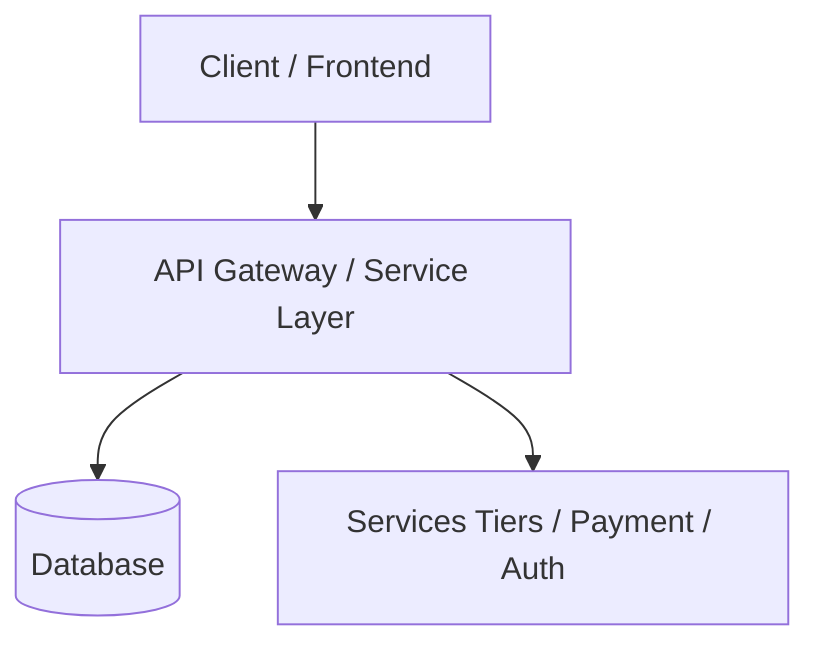

# ARCHITECTURE.md - Vue d'Ensemble & Flux de Données

## 🏗️ Diagramme de Composants

```mermaid
graph TD
    Client[Client / Frontend] --> API[API Gateway / Service Layer]
    API --> DB[(Database)]
    API --> ThirdParty[Services Tiers / Payment / Auth]
```

## 🔄 Flux de Données Principaux
1. Authentification & Sessions
2. Traitement des requêtes métier
