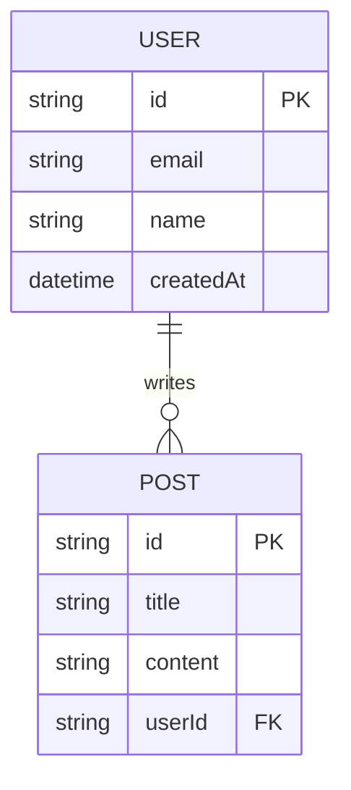

# DATABASE.md - Schéma de Base de Données

## 🗄️ Modèles & Entités

```mermaid
erDiagram
    USER ||--o{ POST : writes
    USER {
        string id PK
        string email
        string name
        datetime createdAt
    }
    POST {
        string id PK
        string title
        string content
        string userId FK
    }
```
